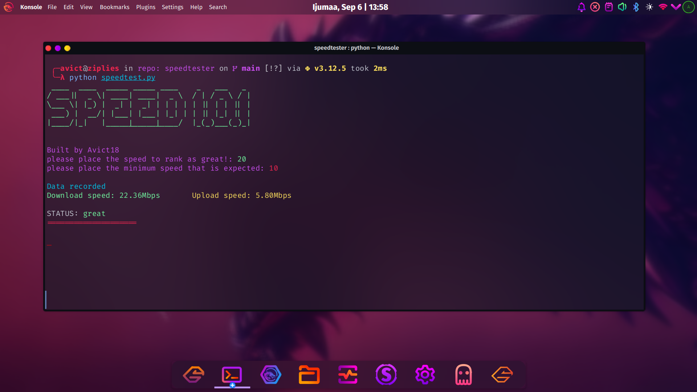

<h1 align="center">
  <br>
</a>
  <br>
  Speedtester
  <br>
</h1>

<h4 align="center">Introducing the next gen command line tool to monitor your internet speed</h4>

<p align="center">
  <a href="https://badge.fury.io/py/pip"></a>
  <a href="">
    
  </a>
</p>

<p align="center">
  <a href="#key-features">Key Features</a> •
  <a href="#how-to-use">How To Use</a> •
  <a href="#download">Download</a> •
  <a href="#license">License</a>
</p>



## Key Features

* LivePreview - See your current internet speed
  - Instantly see what your internet speed is currently
* Summary report
  - A csv file is generated with a summary of the internet speed recorded every single minute

* Cross platform
  - Windows, macOS and Linux ready.

## How To Use

To clone and run this application, you'll need [Git](https://git-scm.com), [speedtest-cli](https://www.speedtest.net/de/apps/cli) and [python](https://python.org) installed on your computer. From your command line:

```bash
# Clone this repository
$ git clone https://github.com/avict18/speedtester

# Go into the repository
$ cd speedtester

# Install dependencies
$ pip install -r requirements.txt

# Run the program
$ python speedtester.py
```

> **Note**
> If you're using Linux use `python3` instead of python

## License

MIT

---
Don't forget to leave me a star
> GitHub [@avict18](https://github.com/avict18) &nbsp;&middot;&nbsp;
> Twitter [@avict18](https://twitter.com/avict18)

